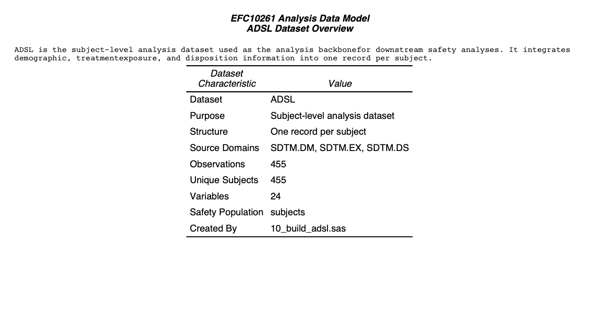
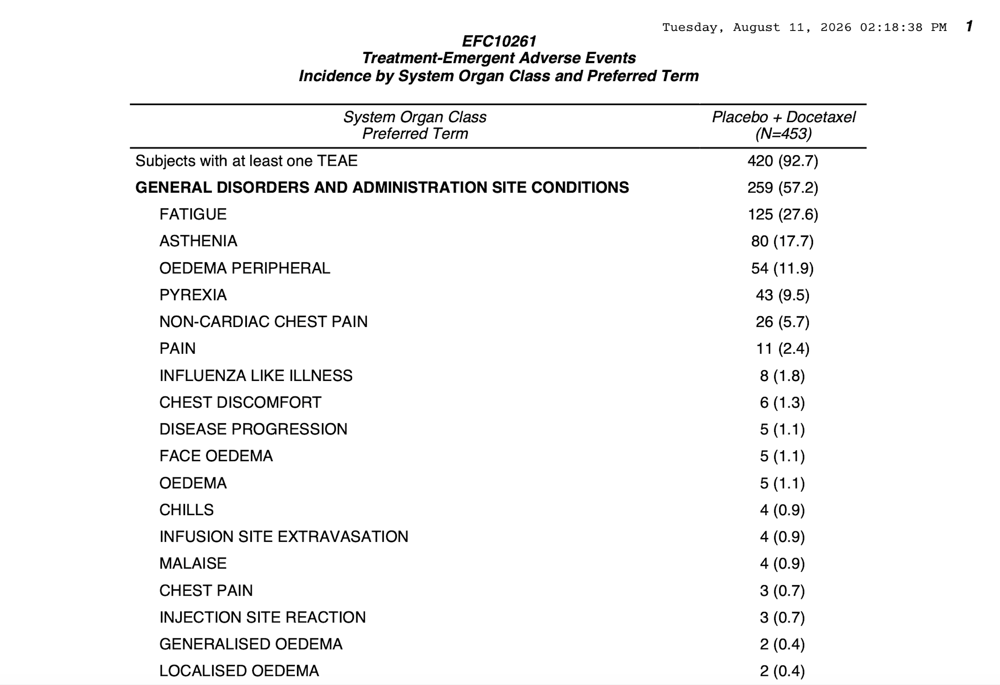
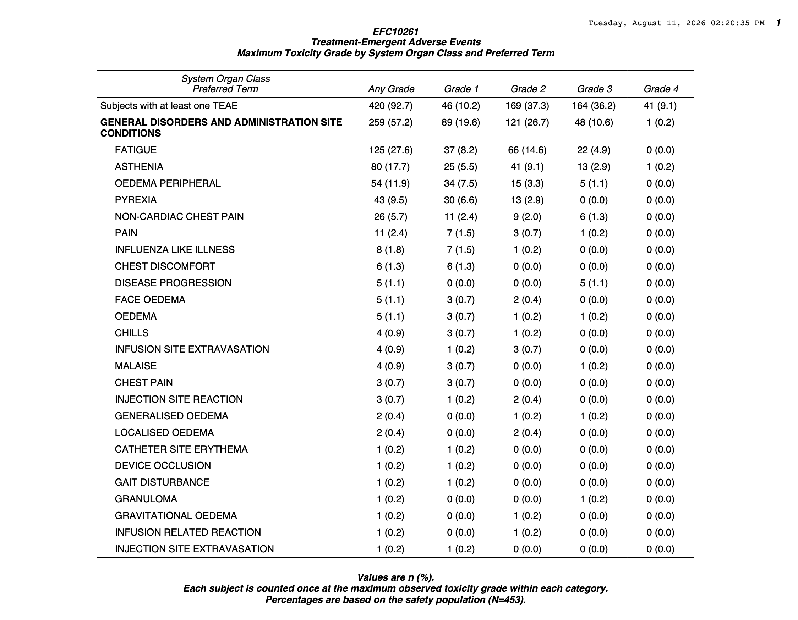
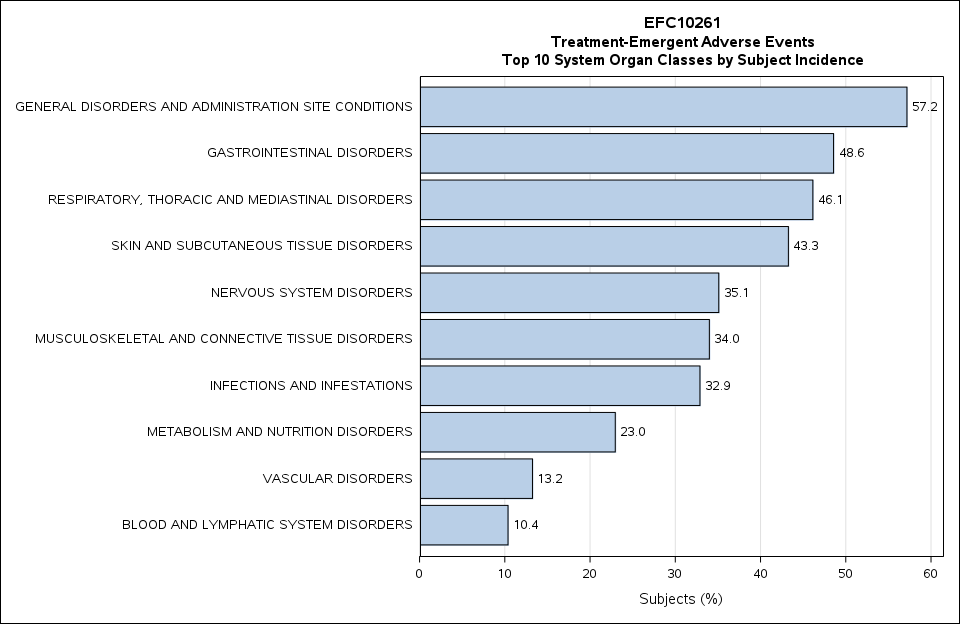
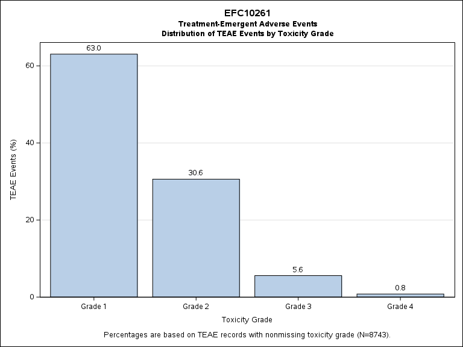

# EFC10261 SAS Clinical Programming Portfolio

This repository presents a sponsor-style clinical programming project developed in SAS using the publicly available Sanofi EFC10261 Phase II Non-Small Cell Lung Cancer (NSCLC) clinical trial submission package.

The project follows a realistic clinical programming workflow from SDTM source data through ADaM dataset development, independent quality control programming, and production of publication-ready safety tables and figures. The objective was to demonstrate programming practices expected of an entry-level Statistical Programmer within the pharmaceutical industry.

---

# Study Overview

| Item | Description |
|------|-------------|
| **Sponsor** | Sanofi |
| **Study** | EFC10261 |
| **Phase** | Phase II |
| **Therapeutic Area** | Non-Small Cell Lung Cancer (NSCLC) |
| **Programming Language** | SAS |
| **Data Standard** | CDISC SDTM → ADaM |

> **Source Data**
>
> This project was developed using the publicly available CDISC SDTM submission package for the Sanofi EFC10261 clinical trial. Source datasets are not redistributed in this repository.

---

# Project Objectives

This portfolio demonstrates the ability to:

- Review and understand CDISC SDTM clinical trial data
- Develop analysis-ready ADaM datasets from SDTM domains
- Independently validate derived datasets using separate QC programs
- Produce sponsor-style safety tables and figures
- Generate publication-ready clinical outputs
- Organize a clinical programming project using production-quality workflows

---

# Repository Structure

```
assets/
documentation/
output/
    compare/
    datasets/
    figures/
    tables/
programs/
    production/
    qc/
    setup/
    tlf/
```

---

# Programming Workflow

The programming workflow mirrors a typical sponsor clinical programming process:

1. Review SDTM source data
2. Develop the ADSL subject-level analysis dataset
3. Independently QC ADSL
4. Develop the ADAE adverse event analysis dataset
5. Independently QC ADAE
6. Produce sponsor-style safety tables and figures

A detailed program execution flow is provided in:

📄 **documentation/program_execution_flow.docx**

---

# Analysis Dataset Development

## ADSL

The subject-level analysis dataset (ADSL) was derived from the SDTM **DM**, **EX**, and **DS** domains.

Key derivations include:

- Safety population flag
- Treatment start and end study day
- Overall treatment duration
- Planned treatment assignment
- End-of-treatment reason
- Last-contact information

### Dataset Summary



---

## ADAE

The adverse event analysis dataset (ADAE) integrates SDTM AE with subject-level variables from ADSL.

Key derivations include:

- Subject demographics
- Treatment assignment
- Treatment timing variables
- ONTRTFL
- POSTTRTFL
- TRTEMFL

Independent QC programs were developed separately for both ADSL and ADAE using sponsor-style validation practices.

---

# Quality Control

Production datasets were independently re-derived using separate QC programs.

Validation included:

- Independent derivation logic
- Dataset structure verification
- Treatment chronology validation
- PROC COMPARE verification against production datasets

QC comparison reports are available in:

```
output/compare/
```

---

# Safety Tables

## Treatment-Emergent Adverse Event (TEAE) Incidence

Publication-ready incidence table summarizing:

- Overall TEAE incidence
- System Organ Class summaries
- Preferred Term summaries
- Subject counts and percentages



---

## TEAE Severity Summary

Publication-ready toxicity summary reporting:

- Any Grade
- Grade 1
- Grade 2
- Grade 3
- Grade 4



---

# Safety Figures

## Top 10 Treatment-Emergent Adverse Events by System Organ Class



---

## Distribution of Treatment-Emergent Adverse Events by Toxicity Grade



---

# Documentation

Additional documentation included in this repository:

- SDTM dataset inventory
- Program execution flow
- Dataset summary reports
- QC comparison reports

---

# Skills Demonstrated

- SAS Programming
- Clinical Trial Programming
- CDISC SDTM
- ADaM Dataset Development
- ADSL Programming
- ADAE Programming
- Independent Quality Control Programming
- DATA Step Programming
- PROC SQL
- PROC REPORT
- PROC SUMMARY
- PROC TRANSPOSE
- PROC SGPLOT
- Clinical Data Validation
- Treatment-Emergent Adverse Event Analysis
- Safety Population Derivation
- Publication-Ready Tables and Figures
- Reproducible Programming Workflows
- Git & GitHub

---

# Disclaimer

This repository was developed for educational and portfolio purposes using a publicly available clinical trial submission package. It is intended to demonstrate sponsor-style SAS clinical programming workflows and does not represent official sponsor deliverables.
